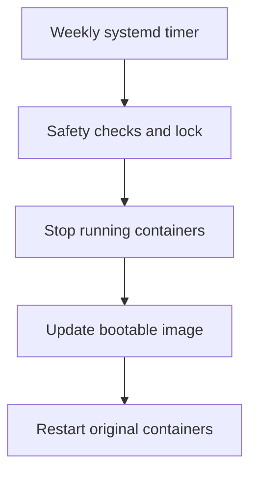

# Raspberry Pi Image Backup Automation

[](https://www.raspberrypi.com/)
[](https://www.gnu.org/software/bash/)
[](https://systemd.io/)
[](LICENSE)

A compact, restorable Raspberry Pi image backup with Docker-aware weekly updates.

I built this project to protect a Raspberry Pi 5 booting from a 2 TB NVMe drive without creating a wasteful 2 TB raw image. It uses RonR's [`image-backup`](https://github.com/seamusdemora/RonR-RPi-image-utils) utility to copy the files that are actually in use into a standard `.img` file. The image can later be written to another boot device and expands on first boot.

The included Bash wrapper and systemd timer safely update the same image every week. Running Docker containers are stopped cleanly before the update and restarted afterward, including when the backup exits with an error.

## Highlights

- Full boot and root filesystem image
- Supports Raspberry Pi OS on NVMe, SSD, USB or microSD
- Avoids copying unused capacity from the source drive
- Incrementally updates an existing image with `rsync`
- Cleanly stops and restarts running Docker containers
- Prevents recursion into external disks through an exclusion file
- Verifies the expected backup mount before writing
- Prevents overlapping jobs with `flock`
- Records the last successful completion time
- Runs unattended through a persistent systemd timer

## How it works



`image-backup` creates the initial raw image and later mounts that image locally to synchronize filesystem changes. The wrapper excludes external mount paths so USB libraries, NAS shares and the destination disk are not copied into the system image.

## Tested setup

- Raspberry Pi 5 with 8 GB RAM
- Raspberry Pi OS 64-bit
- 2 TB NVMe system drive with approximately 105 GB used
- 1 TB NTFS USB backup drive
- Initial image: approximately 127 GB logical / 109 GB allocated
- Docker workloads: Home Assistant, Zigbee2MQTT, Mosquitto and Immich
- Typical incremental update: about one minute with less than one minute of service downtime

Your results will vary with storage speed, file count and the amount of changed data.

## Repository layout

```text
.
├── config/
│   ├── excludes.txt.example
│   └── rpi-image-backup.conf.example
├── docs/
│   ├── RESTORE.md
│   └── TROUBLESHOOTING.md
├── scripts/
│   ├── install.sh
│   └── rpi-image-backup-weekly
└── systemd/
    ├── rpi-image-backup.service
    └── rpi-image-backup.timer
```

## Prerequisites

Install the required packages:

```bash
sudo apt update
sudo apt install -y git rsync gdisk dosfstools e2fsprogs util-linux
```

Install RonR's image utilities:

```bash
cd ~
git clone https://github.com/seamusdemora/RonR-RPi-image-utils.git
sudo install --mode=755 ~/RonR-RPi-image-utils/image-* /usr/local/sbin
```

Confirm that the tool is available:

```bash
sudo image-backup --help
```

## Installation

Clone this repository and run the installer:

```bash
git clone https://github.com/Chi-K24/Chi-K24-raspberry-pi-image-backup.git raspberry-pi-image-backup
cd raspberry-pi-image-backup
sudo bash scripts/install.sh
```

Edit the installed configuration:

```bash
sudo nano /etc/rpi-image-backup.conf
sudo nano /etc/image-backup/excludes.txt
```

At minimum, set:

- `IMAGE_PATH`: existing `.img` file that weekly updates should modify
- `BACKUP_MOUNT`: mount point containing that image
- `EXPECTED_LABEL_PATH`: stable `/dev/disk/by-label/...` link for the destination disk
- `EXCLUDE_FILE`: external mount paths that must never enter the image

The destination image must already exist. This automation intentionally does not create or overwrite the initial image.

Enable the weekly timer only after reviewing the configuration:

```bash
sudo systemctl enable --now rpi-image-backup.timer
systemctl list-timers rpi-image-backup.timer
```

The provided timer runs every Sunday at 03:00 using the Pi's local timezone. Edit `systemd/rpi-image-backup.timer` before installation if you prefer another schedule.

## Creating the initial image

Stop write-heavy applications before the first backup, then run:

```bash
sudo image-backup --options "--exclude-from=/etc/image-backup/excludes.txt"
```

Choose a destination below `/mnt` or `/media`, accept the calculated initial filesystem size, and add reasonable free space for future incremental updates. In my setup I reserved 20,480 MB.

After creation, validate both partitions:

```bash
sudo image-check /path/to/backup.img W95
sudo image-check /path/to/backup.img Linux
```

## Testing the automation

Run one update manually:

```bash
sudo systemctl start rpi-image-backup.service
```

Inspect the result:

```bash
systemctl status rpi-image-backup.service --no-pager -l
sudo journalctl -u rpi-image-backup.service -n 100 --no-pager
sudo docker ps --format 'table {{.Names}}\t{{.Status}}'
```

For a successful one-shot service, `inactive (dead)` is normal after it exits. The important result is `status=0/SUCCESS`.

## Safety notes

- The project never stores or uploads the actual `.img` backup.
- The destination mount and expected device label are verified before writing.
- The script refuses to create a missing image; this prevents accidental large writes into an unmounted directory.
- External drives mounted below `/srv` must be explicitly excluded.
- A single incrementally updated image is not version history. Keep another tested copy on a separate physical device.
- Always perform a real restoration test before treating any backup as proven.

See [RESTORE.md](docs/RESTORE.md) for the restoration checklist and [TROUBLESHOOTING.md](docs/TROUBLESHOOTING.md) for operational commands.

## Acknowledgements

The image creation and synchronization work is performed by RonR's [`image-utils`](https://github.com/seamusdemora/RonR-RPi-image-utils). This repository adds a reusable safety wrapper, configuration layout, Docker coordination and systemd scheduling around that tool.

## License

The automation and documentation in this repository are released under the [MIT License](LICENSE). RonR's image utilities are a separate upstream project and are not redistributed here.
